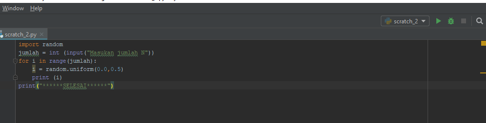
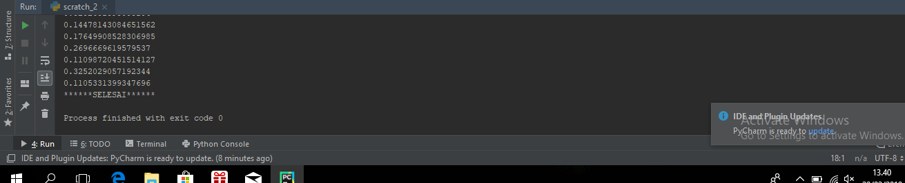
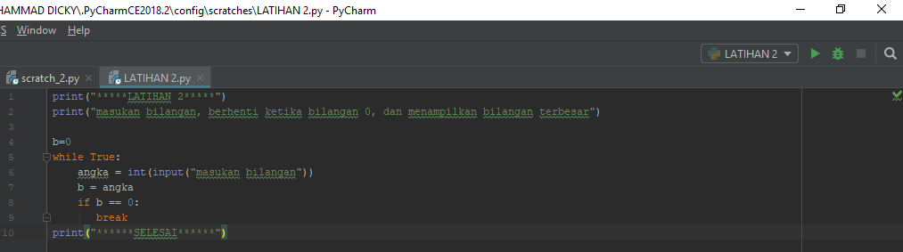
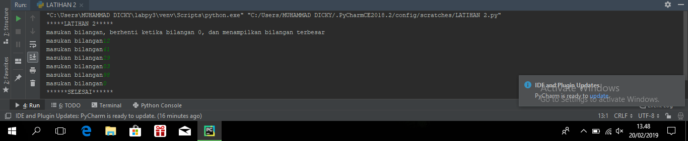
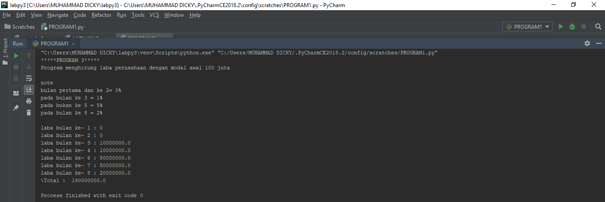

latihan 1:
soal latihan 1:
1.Tampilkan n bilangan acak yang lebih kecil dari 0,5.
2.nilai n diisi pada saat runtime.
3.anda bisa menggunakan kombinasi while dan for untuk menyelesaikannya
4.gunakan fungsi random()yang dapat diimport terlebih dahulu

Algoritma latihan 1:

menampilkan n bilangan acak yang lebih kecil dari 0,5 nilai diisi pada 
saat runtime.

1.memasukan /import fungsi RANDOM terlebih dahulu
2.deklarasi integer,masukan jumlah n:
3.memasukan deksripsi komninasi for untuk menyelesaikan nya
4.memasukan nilai jumlah(n):5
5.mencetak data ke 1 sampai 5 dengan hasil nilai kurang dari 0,5
6.selesai
syntax latihan 1 sebagai berikut
#  <h2>

hasil output latihan 1 sebagai berikut:
#  <h2>

soal latihan 2:
memperbesar program untuk menampilkan bilangan terbesar dari bilangan terbesar dari n buah data yang diinputkan.Masukan angka 0 untuk berhenti.

1.mulai

2.Mencetak "latihan 2"
3.mencetak "menampilkan bilangan,berhenti ketika bilangan 0,menampilakn bilangan terbesar"
4.integer max= 0
5.menggunakan fungsi perulangan while true,hingga menampilkan perulangan sampai batas tertentu.
6.memasukan bilangan integer pada"a"
7.mengunakan fungsi if jik max kurang dari nilai a,maka max sama dengan a
8.menggunakan fungsi if jika nilai adalah 0 maka fungsi break artinya perulangan berhenti jika menulis nilai 0.
9.mencetak nilai paling terbesar setelah break,sehingga menampilkan nilai terbesar diantara bilangan tersebut dalam perulangan.
10.selesai

syntax latihan 2 sebagai berikut :
#  <h2>

hasil output latihan 2 ketika di runtime 
#  <h2>

program latihan 1
1.mulai
2.mencetak latihan1
3.mencetak "program menghitung laba dengan modal awal 100 juta"
4.membuat note
5.mencetak bulan pertama dan kedua=0%
6.mencetak bulan ke 3 =1%
7.mencetak bulan ke 5= 5%
8.mencetak bulan ke 8= 2%
9.integer a= 100.000.000(modal awal)
10.menggunakan fungsi looping for pada nilai x 1-9 untuk menampilkan bulan 1 sampai bulan 8
12.bukan pertama dan kedua laba adalah 0
13.bulan ke 3 dan 4 mendapat laba 1%= keuntungan
15.bulan ke 8 mendapatakan laba 2% sehingga keuntungan menurun dari bulan sebelumnya,modal dikali 2%= keuntungan.
16.menghitung jumlah total laba denga mennjumlah  keuntungan dari bulan ke 1 sampai bulan ke 8,hasilnya adalah total keuntungan yang di dapat.
17.selesai

syntax program 1 sebagai berikut
# 1[Github Logo](5.png) <h2>
hasil dari output program 1 ketika di runtime
#  <h2> 
